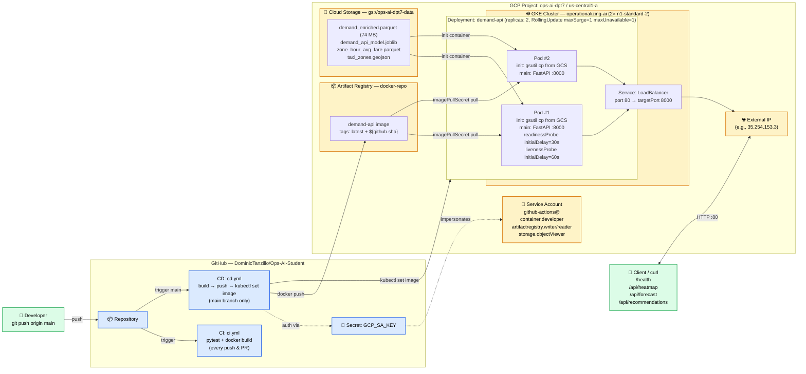

# Week 2 — Architecture Diagram

## Required by README

> Show: GitHub → Artifact Registry → GKE → external IP

## Rendering instructions

The Mermaid source below renders cleanly via:

1. **https://mermaid.live** (recommended): paste the source between the ```` ```mermaid ```` fences, then **Actions → Export to PNG** (or SVG / PDF). Save as `week2/architecture.png` or `week2/architecture.pdf`.
2. **VS Code**: install the *Markdown Preview Mermaid Support* extension, then open this file and use the markdown preview.
3. **GitHub**: it renders inline in markdown previews automatically when you push the repo.

---

## Architecture (Mermaid source)



---

## ASCII fallback (in case Mermaid rendering is unavailable)

```
                    ┌─────────────────────────────────┐
                    │  GitHub  DominicTanzillo/...    │
                    │                                 │
   developer ──push─►  Repository                     │
                    │       │                         │
                    │       ├── CI (ci.yml):          │
                    │       │   pytest + docker build │
                    │       │                         │
                    │       └── CD (cd.yml, main only)│
                    │              │                  │
                    │              ▼ uses Secret      │
                    │           GCP_SA_KEY            │
                    └──────────────│──────────────────┘
                                   │ auth as
                                   ▼
                    ┌─────────────────────────────────────────────┐
                    │  GCP Project: ops-ai-dpt7 / us-central1-a   │
                    │                                             │
                    │  Service Account: github-actions@           │
                    │    container.developer                      │
                    │    artifactregistry.writer + reader         │
                    │    storage.objectViewer                     │
                    │                                             │
                    │   ┌─────────────────────┐                   │
   docker push ────►│   │ Artifact Registry   │                   │
                    │   │ docker-repo:        │                   │
                    │   │  demand-api:latest  │                   │
                    │   │  demand-api:$sha    │                   │
                    │   └──────────┬──────────┘                   │
                    │              │ image pull                   │
                    │              ▼                              │
                    │   ┌─────────────────────────────────────┐   │
                    │   │ GKE Cluster: operationalizing-ai    │   │
                    │   │ 2× n1-standard-2                    │   │
                    │   │                                     │   │
                    │   │ Deployment: demand-api (2 replicas) │   │
                    │   │   ┌─────────┐  ┌─────────┐          │   │
                    │   │   │ Pod #1  │  │ Pod #2  │          │   │
                    │   │   │ init:   │  │ init:   │◄──┐      │   │
                    │   │   │  gsutil │  │  gsutil │   │      │   │
                    │   │   │ main:   │  │ main:   │   │      │   │
                    │   │   │ FastAPI │  │ FastAPI │   │      │   │
                    │   │   │ :8000   │  │ :8000   │   │      │   │
                    │   │   └────┬────┘  └────┬────┘   │      │   │
                    │   │        └──────┬─────┘        │      │   │
                    │   │               ▼              │      │   │
                    │   │  Service: LoadBalancer       │      │   │
                    │   │    port 80 → 8000            │      │   │
                    │   └───────────────┬──────────────┘      │   │
                    │                   │                     │   │
                    │  ┌────────────────▼──────────────────┐  │   │
   client / curl ───┤  │  External IP   35.254.153.3       │  │   │
   /health, /api/* ─►  └───────────────────────────────────┘  │   │
                    │                                          │  │
                    │  ┌────────────────────────────────────┐  │  │
                    │  │ Cloud Storage                      │  │  │
                    │  │ gs://ops-ai-dpt7-data              │  │  │
                    │  │   demand_enriched.parquet (74 MB)  │──┘  │
                    │  │   demand_api_model.joblib          │     │
                    │  │   zone_hour_avg_fare.parquet       │     │
                    │  │   taxi_zones.geojson               │     │
                    │  └────────────────────────────────────┘     │
                    └─────────────────────────────────────────────┘
```

---

## What each arrow proves (for the design report)

| Edge | Operational property it demonstrates |
|---|---|
| Developer → Repository (push) | Source-of-truth is git; no out-of-band production changes |
| Repository → CD | Trigger is push-to-main; production is automated from green CI |
| CD → Secret → SA | Credentials never live on developer laptops; rotated by deleting key.json + recreating |
| CD → Artifact Registry | Immutable image artifacts tagged by git SHA enable rollback (`kubectl rollout undo`) |
| Artifact Registry → Pod | Private AR + IAM-gated read enforces supply-chain integrity (READING.md lines 86-98) |
| GCS → init container | Decouples model artifacts from image: rebuild image without rebuilding model; tradeoff: ~30s startup |
| Service: LoadBalancer | GCP-managed L4 LB gives stable external IP; survives pod restarts |
| readinessProbe ≠ livenessProbe (30s vs 60s initialDelay) | Per READING.md line 40: avoid restart cascades on slow model load |
