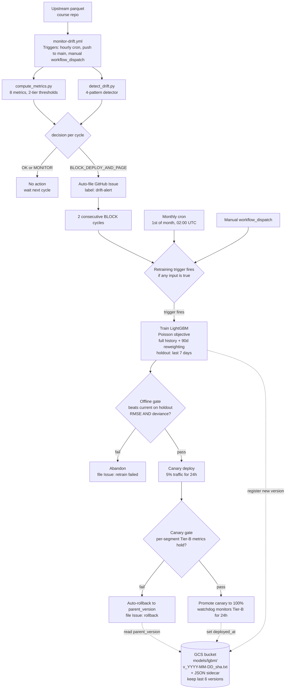

# Week 4 Architecture Diagram

Mermaid source for the drift monitoring + retraining workflow.

Render at https://mermaid.live and export as PNG or SVG for embedding in
the Week 4 report.

## How to render

1. Open https://mermaid.live in a browser.
2. Paste everything between the triple backticks above (the `flowchart TD ...`
   block) into the left editor pane.
3. The diagram appears in the right pane.
4. Click `Actions` (top right corner) and choose `PNG` or `SVG`.
5. Insert the exported image into the Week 4 report.

## What is in the diagram

- DATA SOURCE: upstream parquet from the course repo
- MONITOR: monitor-drift.yml with all three triggers labeled (hourly cron,
  push to main, manual workflow_dispatch)
- DRIFT EVAL: compute_metrics.py and detect_drift.py running in parallel
- DECISION: per-cycle gate that either takes no action or files a
  drift-alert GitHub Issue
- TRIGGER: retraining trigger evaluator with three possible inputs
  (2 consecutive BLOCK cycles, monthly cron, manual workflow_dispatch)
- TRAIN: LightGBM Poisson training on full history with 90-day
  reweighting, holding out the last 7 days
- VALIDATE: offline gate (must beat current model on holdout RMSE and
  Poisson deviance) followed by 5% canary for 24 hours
- DEPLOY: promote canary to 100% with a 24-hour watchdog, or auto-rollback
  to parent_version on failure
- STORAGE: GCS bucket with versioned model files and JSON metadata
  sidecars; last 6 versions kept

The dashed arrows are reads and writes against the GCS bucket: train
writes a new version, promote sets the deployed_at field, rollback reads
the parent_version key.
